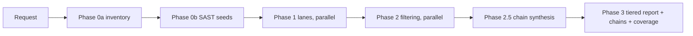

# Security Review

A read-only security review of source code. Use [SKILL.md](./SKILL.md) for the workflow itself; this file covers when to reach for it and how to scope a run.

It never tests a running system. Findings that need live validation are handed to a human.

## What it does

A deterministic five-phase pipeline:

| Phase | What happens | Concurrency |
|---|---|---|
| 0a | Inventory: classify in-scope files by language, role, trust boundary | main thread |
| 0b | SAST seeding: run approved scanners, collect unvalidated candidates | main thread |
| 1 | Discovery: one agent per applicable lane, each with an ASVS/CWE checklist | parallel |
| 2 | Filtering: one agent per candidate, scored 1–10 against a six-question rubric | parallel |
| 2.5 | Chain synthesis: compose verified findings into scored attack paths | main thread |
| 3 | Synthesis: dedupe, tier A/B/C, render chains + coverage report | main thread |

The inventory is what makes runs comparable — two reviews of the same PR start from the same attack surface and produce the same lane coverage.

## Typical prompts

- "Run a security review on this PR."
- "Security review `src/billing` — focus on tenant isolation."
- "Review this branch for security regressions before I open the PR."

## Scoping a run

Scope defaults to the pending changes on the current branch. Override it by naming a file, directory, PR number, or branch.

Recommended scope statement:

> Scope: `[PR | path | file list]`. Focus: `[lanes or categories]`. Exclude: `[paths/categories]`.

Examples:

- "Scope: PR #123. Focus: auth/authz and input validation. Exclude: docs and tests."
- "Scope: `src/payments` and `src/auth`. Focus: trust boundaries and secret handling."
- "Scope: this branch. Focus: L03 and L12 only."

Focus is expressed either in plain terms ("tenant isolation", "secrets") or by lane ID from [Discovery Lanes](./references/discovery-lanes.md) — that doc is the authoritative category list. Naming lanes narrows which ones run; naming categories biases emphasis but still runs every lane whose predicate matches.

Test files are excluded automatically via the inventory's `is_test` flag.

## Reading the output

- **Tier A** (score ≥ 7) — high confidence, in the main report. Act on these.
- **Tier B** (score 4–6) — reachability or attacker control unproven. Needs a human, or authorized live testing outside this skill.
- **Tier C** (score ≤ 3) — run artifact only, not rendered.
- **Coverage report** — each lane's status (ran, predicate gap, n/a, or skipped) and why, which ASVS chapters were touched, which scanners were unavailable. Read this before trusting a clean report.

An empty Tier A is stated explicitly, never padded.

## Flow

## Governance

Tool policy lives here:

- [Approved Tool Catalog](./references/approved-tool-catalog.md)
- [Tool Safety Rules & Prohibited Patterns](./references/tool-safety-rules.md)
- [Tool Approval Workflow](./references/tool-approval-workflow.md)

Shell execution is confined to Phase 0. Phases 1–3 are read-only.

## License

This repository is licensed under the MIT License. See [LICENSE](./LICENSE).

Some third-party-derived documentation is licensed separately:

- [references/asvs-v5-chapters.md](./references/asvs-v5-chapters.md) contains ASVS-derived material under CC BY-SA 4.0.
- See [THIRD_PARTY_LICENSES.md](./THIRD_PARTY_LICENSES.md) for attribution and details.
